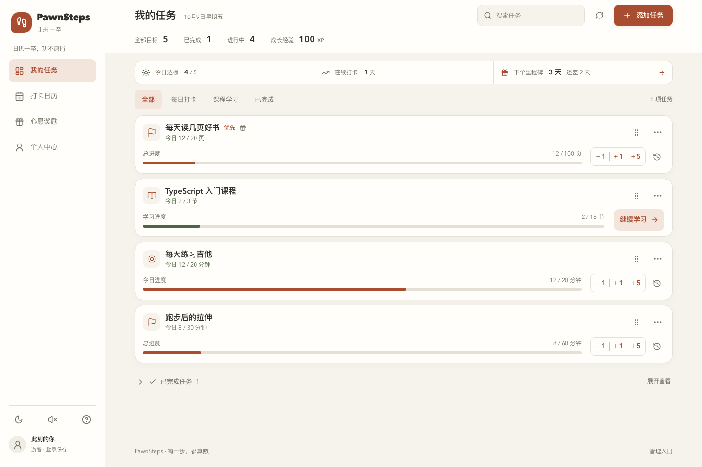

# PawnSteps · 日拱一卒



习惯养成与目标追踪应用。前后端独立，提供 FastAPI REST API、Next.js 15 页面、浅色/暗色主题和 Docker Compose 部署。

## 本地运行

需要 Python 3.12、Node.js 22。下列命令从仓库根目录开始执行。

```bash
uv venv --python 3.12 .venv
uv pip install --python .venv/bin/python -r backend/requirements.lock
cp .env.example backend/.env
cd backend
../.venv/bin/alembic upgrade head
../.venv/bin/uvicorn app.main:app --reload --host 127.0.0.1 --port 8000
```

另开一个终端：

```bash
cd frontend
npm ci
npm run dev
```

打开 <http://localhost:3000>，API 文档为 <http://localhost:8000/api/docs>。游客无需注册即可使用。开发数据库为 `backend/pawnsteps.db`，图片位于 `backend/uploads/`。如果没有 uv，也可使用 `python3.12 -m venv .venv` 和 `.venv/bin/pip install -r backend/requirements.lock`。

前端代理地址由启动或构建时的 `API_BASE_URL` 控制，默认 `http://127.0.0.1:8000`；API 密钥不会进入浏览器。修改独立部署的代理目标后需要重新构建 Next.js。

## 已实现

| 功能 | 行为 |
| --- | --- |
| 普通任务 | 1–100 目标量、自定义单位、优先级、描述、关联奖励；大字号完成量、独立分段进度格与每日达标线，−1/+1/+5 步进、数字滚动和进度格依次弹起；达标与任务完成有独立动画，支持减少动态效果；全部完成时提示撤回最后一笔；支持其他数量、备注与历史修正；未完成任务拖拽排序、已完成沉底 |
| 任务归档 | 更多菜单归档与恢复；保留进度、历史、课程与 XP；归档中只读，暂停后续打卡要求，恢复沿用原周期和计划日期；支持搜索、分页及删除撤销 |
| 每日任务 | 一天可多次记录，独立每日配额、跨天重置、同日达标只计一天；可修改或撤销历史记录 |
| 天数计划 | 按记录累计实际配额贡献，0/-1 自动休息日；计划到期标记结束，保留实际进度 |
| 课程学习 | TXT/Markdown 大纲、文件夹文件名导入；课程卡打开详情抽屉；文件夹分组或 25 项分组；折叠、单选/全选、鼠标框选完成与取消、完成状态变绿 |
| 删除恢复 | 服务端验证的 5 秒撤销令牌，绑定当前 owner |
| 奖励 | 图片、增删改、手动锁定/解锁、拖拽排序；完成任务自动解锁；弹窗动效 |
| 连续打卡 | 3/7/14/30/60/100 天里程碑；数据库唯一约束避免重复创建；禁止删除 |
| 课程每日计划 | 设置最小节数与每日目标，接入日历和连续打卡；打开课程定位下一节，支持关闭计划 |
| 周期与休息日 | 每天、指定星期、每周若干达标日；休息任务折叠，日历标记休息日 |
| 日历 | 月历/列表切换、月份导航、任意任务进度圆点与每日完成量详情 |
| 声音 | Web Audio 合成步进、任务完成、每日达标、奖励解锁四种声音；静音持久化 |
| 认证 | 密码、邮箱验证码、微信网站扫码；游客任务限制与注册/登录迁移 |
| 个人中心 | 头像、用户名、统计、修改/设置密码、JSON 数据导出 |
| 管理后台 | `/admin` 独立登录、用户搜索/分页、用户任务/奖励查看及导出 |
| 统计 | 顶部紧凑横栏常驻显示全部/完成/进行中/XP；XP = 完成任务数 × 100 |

游客最多 10 个任务，其中每日或计划任务最多 3 个，归档任务也计入额度。所有业务数据均按 `owner_id` 隔离。日期按服务端 `TIMEZONE`（默认 `Asia/Shanghai`），API 返回 `today`、`timezone` 供前端同步，避免客户端与服务器跨天不一致。

课程文件夹导入只读取文件路径和名称，不上传课程文件内容。清单中的 `条目 | 1` 等尾部整数标记会从标题中清理；已有课程也会显示清理后的标题，原有勾选状态保留。标题需要保留字面竖线时可写作 `\|`，代码或非数字竖线内容保持原样。桌面鼠标可从条目文字或空白处拖动框选：有未完成项则批量完成，全已完成则批量取消；按住 Shift 可强制取消。长列表支持边缘自动滚动，Esc 取消本次框选，触屏继续使用点选。图片上传支持 PNG/JPEG/WebP，最大 5 MB，服务端重新解码编码并限制像素尺寸。

## 邮箱、微信与图片存储

这些接口包含完整的服务端流程，真实调用需要提供相应服务凭据。

- **邮箱**：配置 `SMTP_HOST/PORT/USERNAME/PASSWORD/FROM`；生产要求 STARTTLS。开发时可显式设置 `SMTP_ALLOW_CONSOLE=true`，验证码只输出到本地后端日志。注册时邮箱可留空；填写邮箱则必须输入验证码。验证码有效期 10 分钟，最多 5 次尝试，使用后失效。
- **微信**：使用微信开放平台已审核的网站应用；配置 `WECHAT_APP_ID`、`WECHAT_APP_SECRET` 和 `WECHAT_REDIRECT_URI=https://你的域名/api/auth/wechat/callback`。回调与前端应使用同一公网域名。按钮打开微信官方二维码登录页面；浏览器绑定的 state 和短效一次性 ticket 完成授权。
- **S3**：设置 `STORAGE_BACKEND=s3`、`S3_BUCKET`、`S3_REGION`、`S3_PUBLIC_BASE_URL`，并配置 IAM 角色或 `S3_ACCESS_KEY_ID/S3_SECRET_ACCESS_KEY`。兼容存储可设置 `S3_ENDPOINT_URL`。公开图片使用专用 CDN 或静态资源域名；后端不返回存储凭据。

## Docker Compose

```bash
cp .env.example .env
```

修改 `.env` 中的 `JWT_SECRET` 和 `POSTGRES_PASSWORD`。可用 `openssl rand -hex 48` 与 `openssl rand -hex 24` 分别生成；数据库密码需为 URL 安全字符。

```bash
docker compose up -d --build
docker compose ps
curl http://localhost:8080/api/health
```

默认仅绑定本机 `127.0.0.1:8080`。服务顺序为 PostgreSQL 健康检查 → Alembic 一次性迁移 → FastAPI → Next.js standalone → Nginx；数据库和上传文件分别持久化到卷。生产镜像以非 root 用户运行应用进程。

生产还需设置：

```dotenv
ENVIRONMENT=production
FRONTEND_URL=https://pawnsteps.example.com
PUBLIC_BASE_URL=https://pawnsteps.example.com
CORS_ORIGINS=["https://pawnsteps.example.com"]
ALLOWED_HOSTS=["pawnsteps.example.com","localhost","127.0.0.1","backend"]
WECHAT_REDIRECT_URI=https://pawnsteps.example.com/api/auth/wechat/callback
```

由已有的 HTTPS 入口将该域名转发至 `127.0.0.1:8080`；也可使用下方 Nginx TLS 覆盖配置。生产启动会拒绝示例 JWT 密钥、通配允许域名及 HTTP 前端地址。生产关闭 Swagger/OpenAPI 公共文档。

```bash
# TLS_CERT_DIR contains fullchain.pem and privkey.pem for the public domain.
TLS_CERT_DIR=/absolute/path/to/certificates docker compose -f compose.yaml -f compose.tls.yaml up -d --build
```

TLS 覆盖配置需 Docker Compose 2.24.4 或更新版本，监听公网 80/443。证书签发及续期由部署方的证书服务管理。若自定义环境文件，可设置 `PAWNSTEPS_ENV_FILE=/absolute/path/app.env`，同时传入 `docker compose --env-file /absolute/path/app.env`。

创建独立管理员：

```bash
# Configure ADMIN_USERNAME, ADMIN_PASSWORD and optional ADMIN_EMAIL in .env first.
docker compose exec backend python -m app.cli create-admin
```

本地开发对应命令为 `cd backend && ../.venv/bin/python -m app.cli create-admin`。没有预置管理员密码；引导命令不会把普通用户提升为管理员，也不会重置已有管理员密码。

已部署的服务器可在项目目录执行 `bash scripts/update.sh` 更新 `origin/main`。首次获取脚本先运行 `git pull --ff-only origin main`；之后脚本会自行获取版本。新版镜像构建完成后，脚本短暂停止应用写入，备份 PostgreSQL、本地上传图片和环境文件，再执行迁移、重建应用并检查 API 入口。已有 Compose 覆盖文件和 TLS 证书挂载自动沿用，数据库容器和持久卷保持原样；本地上传之外的 S3 对象由存储服务自身备份。备份保存在 `.pawnsteps-deploy/backups/`，包含私密数据，已排除 Git 和镜像构建。

`bash scripts/update.sh --check` 仅检查版本，`--force` 可重新部署当前版本；自定义环境文件使用 `--env-file /absolute/path/app.env`。拉取使用 HTTP/1.1，单次最多 120 秒，失败后重试一次；网络较慢时可使用 `PAWNSTEPS_FETCH_TIMEOUT=300 bash scripts/update.sh` 调整到 300 秒。拉取失败会退出，保留旧站点。脚本使用 Ubuntu coreutils 提供的 `timeout` 命令。首次运行即使代码已经拉到最新也会部署，之后相同版本和配置会跳过重建。构建失败时旧服务保持运行；备份失败时尝试恢复原容器；迁移或健康检查失败时应用暂停，保留备份供排查或恢复，不自动降级数据库。数据库连接、持久卷或 PostgreSQL 镜像版本改变时需要人工确认。不要对需要保留的数据执行 `docker compose down -v`。

## 验证

```bash
uv pip install --python .venv/bin/python -r backend/requirements-dev.txt
cd backend
../.venv/bin/pytest -q
../.venv/bin/alembic check
```

SQLite 测试自动使用独立内存库。设置 `TEST_DATABASE_URL=postgresql+asyncpg://...` 可运行 PostgreSQL 并发用例；**只能使用可销毁的专用测试数据库**，测试 fixture 会创建并删除表。

```bash
cd frontend
npm run typecheck
npm run build
npm audit
npx playwright install chromium
```

端到端测试连接真实 API。后端启动在 8017，前端以 `API_BASE_URL=http://127.0.0.1:8017 npm run dev -- --port 3017` 启动，然后执行 `npm run test:e2e`。也可通过 `E2E_BASE_URL` 指向其他专用测试环境。管理员用例需设置 `E2E_ADMIN_USERNAME` 和 `E2E_ADMIN_PASSWORD`；测试生成的数据只用于独立随机游客或测试账号。测试报告见 `frontend/playwright-report/`。

后端依赖已在 `requirements.lock` 固定，前端由 `package-lock.json` 固定。升级后运行数据库与浏览器测试。当前保留的 python-jose/ecdsa 审计项适用范围和 HS256 限定见 [安全说明](docs/security.md)。Next.js 使用 15.5.27，并对 PostCSS 依赖应用补丁覆盖，参考 [Next.js 官方安全公告](https://nextjs.org/blog/september-2026-security-release)。

## 代码导航

```text
backend/
  app/models.py             SQLAlchemy models and constraints
  app/schemas.py            Public tracking contracts
  app/auth.py               JWT and owner dependencies
  app/services/             Business transactions, accounts, storage
  app/routers/              Validated HTTP entry points
  alembic/                  Versioned migrations
  tests/                    HTTP integration and concurrency regressions
frontend/
  app/                      App Router pages and global tokens
  components/               Dashboard, tasks, courses, rewards, calendar, account
  components/ui/            shadcn-compatible Radix primitives
  lib/                      API, Zustand state, audio, course parsing
  tests/                    Browser acceptance tests
deploy/                     Nginx reverse proxy and TLS configuration
design-system/pawnsteps/    ui-ux-pro-max output and application override
```

[API 契约](docs/api.md) · [业务与架构约定](docs/architecture.md) · [安全说明](docs/security.md) · [验收记录](docs/verification.md)

`is_premium` 按需求预留，当前不包含支付收款、订阅计费、退款或发票。接入真实 SMTP、微信、S3、域名和证书后可部署这些已实现的功能；收费还需确定支付渠道和订阅规则。
